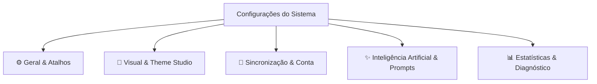

# Plano de Expansão: Nota de Configurações (Settings Plan)

Este documento reflete as especificações exatas e o feedback do usuário para a nota de **Configurações** do **ConnectedNotes**, mantendo a identidade visual **Moscaro Moderno** (*Cyberpunk Liquid Glass*) e a iconografia 100% SVG.

---

## 🎨 Diretrizes de Design & Arquitetura (Moscaro Standard)

1. **Sem Emojis**: Iconografia 100% vetorial através de componentes SVG (`src/icons.rs`).
2. **Estética Liquid Glass & Customização de Desempenho**: Fundo escuro translúcido (`rgba(14, 16, 24, 0.95)`), desfoque (*backdrop-filter: blur*), bordas neon ciano (`#00e1ff`) e suporte a **Modo Opaco de Alto Desempenho** (sem transparência/blur para economia de GPU).
3. **Navegação Horizontal por Pills**: Barra de categorias no topo com abas em pílula, suporte a seleções iluminadas e badges em tempo real.
4. **Scrollbars Globais Customizadas**: Barras de rolagem em vidro fosco com manípulos ciano/roxa e brilho em *hover*.

---

## 🗂️ Mapeamento Detalhado das Categorias & Funcionalidades

---

### 1. ⚙️ Aba "Geral & Atalhos"
- **Salvamento Automático Permanente**:
  - O salvamento no cofre `vault.db` e no disco é **sempre ativo por padrão** (sem opção de desativação), garantindo integridade total dos dados.
- **Gerenciador do Cofre (`vault.db`)**:
  - Exibição do caminho físico do arquivo `.db` com botões **Copiar Caminho** e **Abrir Pasta**.
  - **Backup & Restauração 1-Clique**: Exportar cópia do banco local ou importar cofre existente.
- **Editor Personalizável de Atalhos de Teclado**:
  - Interface interativa para **reconfigurar qualquer atalho do sistema** (`Ctrl + K`, `Ctrl + N`, `Space + Arrastar`, etc.).
  - **Detector Automático de Conflitos**: Alerta visual instantâneo se uma combinação de teclas for atribuída a duas ações diferentes.
- **Opção de Sessão**:
  - Restaurar últimas abas abertas ao iniciar o programa (Toggle).

---

### 2. 🎨 Aba "Visual & Theme Studio"
- **Theme Studio Completo**:
  - **Customização Granular de Cores**: Edição individual de cada elemento da interface:
    - Cor Principal de Fundo
    - Cor de Detalhes
    - Cor de Destaque / Acento
    - Cor das Bordas e Neon
    - Cor do Texto Secundário
  - **Imagem de Fundo Customizada**: Permite definir uma imagem de fundo própria para cada tema.
  - **Suporte a CSS Externo**: Opção para carregar arquivos `.css` customizados criados pela comunidade.
- **Otimização de Hardware & Modo Opaco**:
  - Opção para **desativar transparência e blur** totalmente para aparelhos mais fracos.
  - Quando a transparência for desativada, o usuário pode definir a **cor sólida opaca** para cada categoria de painel/item afetado.
- **Pré-visualização do Fundo (Paper Mode)**:
  - Mini-cards ilustrativos com preview de estilo de folha: Pontilhado, Quadriculado, Pautado e Escuro Puro.

---

### 3. 🔄 Aba "Sincronização & Conta"
- **Tela de Entrada de Acesso (Centralizada)**:
  - Opção 1: **Criar Conta Local / Perfil**.
  - Opção 2: **Fazer Login / Conectar via PIN**.
  - Opção 3: **Continuar como Convidado (Modo Offline)**.
- **Perfil Local & Dispositivo**:
  - Edição de *Nome de Usuário* e *Nome do Dispositivo* salvos no `vault.db`.
- **Pareamento P2P por PIN**:
  - PIN local de 6 dígitos + Conectar a PIN de outro dispositivo na rede Wi-Fi.
- **Dispositivos Conectados na LAN**:
  - Lista em tempo real de peers pareados com status de sincronia.
- **Preferências de Atualização Delta (Habilitado para Logados)**:
  - Seleção de taxa: *50ms (Ultra Rápido)*, *150ms (Equilibrado)*, *500ms (Economia)*.

---

### 4. ✨ Aba "Inteligência Artificial & Biblioteca de Prompts"
- **Provedor & Validação de API**:
  - Provedor (Auto, Gemini, OpenAI, Ollama Local).
  - Botão **Testar Chave de API** com medição de latência em tempo real (`✓ Conexão OK - Latência 115ms`).
- **Gerenciador Visual de Prompts por Categoria**:
  - Organização visual dos Prompts do Sistema em "categorias" (ex: *Explicar Fórmula*, *Gerar Mermaid*, *Resumo Executivo*, *Criar Flashcard*).
  - Visualmente apresentados como cartões/arquivos separados para facilidade de organização, mas **armazenados em um único arquivo JSON vinculado à conta do usuário**.

---

### 5. 📊 Aba "Estatísticas & Diagnóstico"
- **Dashboard do Cofre**:
  - Gráficos e estatísticas de uso (número de notas, subnotas, cards por tipo, conexões e tamanho de mídia).
- **Monitor de Tráfego P2P**:
  - Métricas de pacotes enviados/recebidos por segundo na sincronização local.
- **Sincronia do Diagrama Mermaid**:
  - Os diagramas Mermaid adotam **automaticamente o mesmo tema ativo do sistema**.

---

## ⏳ Recursos Futuros (Backlog Pós-Lançamento)
- Executores de Código em Sandbox Nativo (`python.exe`, `node.exe`, `cargo.exe`).
- Aba dedicada de Estudo & Flashcards com algoritmo de Repetição Espaçada (SM-2).

---

## 🚀 Plano de Execução em Fases

> [!IMPORTANT]
> A implementação será executada de forma incremental, mantendo o projeto compilando com `cargo check`.

### Fase 1: Interface Visual & Ajustes de Geral
- [x] Abas horizontais no padrão Moscaro sem toolbar.
- [x] Tela inicial de escolha de conta (Criar Conta, Login via PIN, Convidado).
- [ ] Remoção da opção de salvamento automático (mantendo-o sempre ativo).
- [ ] Validador de Chave de API em 1-clique com ping na aba IA.
- [ ] Gerenciador do Cofre (`vault.db`) com cópia de caminho e backup 1-clique.

### Fase 2: Editor de Atalhos & Theme Studio Granular
- [ ] Editor interativo de atalhos de teclado com detecção visual de conflitos.
- [ ] Theme Studio com paleta de cores granular, suporte a imagem de fundo e CSS externo.
- [ ] Modos de otimização de hardware (Desativar Transparência / Blur com cores sólidas configuráveis por categoria).

### Fase 3: Biblioteca de Prompts por Categoria
- [ ] Sistema visual de categorias de Prompts da IA (salvos no JSON da conta).
- [ ] Sincronização de tema dos diagramas Mermaid com o sistema geral.

---

## 🔍 Plano de Verificação

### Testes Automatizados
- Execução contínua de `cargo check` a cada funcionalidade.

### Verificação Manual
- Testar remapeamento de atalhos e detecção de conflito.
- Validar carregamento de CSS externo e imagem de fundo no Theme Studio.
- Validar alteração de cores sólidas no modo de alto desempenho (sem transparência).
- Testar salvamento da biblioteca de prompts vinculada ao perfil local.
