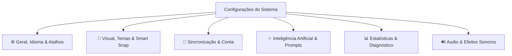

# Plano de Expansão: Nota de Configurações (Settings Plan)

Este documento apresenta a especificação completa e atualizada para a nota de **Configurações** do **ConnectedNotes**, mantendo a identidade visual **Moscaro Moderno** (*Cyberpunk Liquid Glass*) e a iconografia 100% SVG.

---

## 🎨 Diretrizes de Design & Arquitetura (Moscaro Standard)

1. **Sem Emojis**: Iconografia 100% vetorial através de componentes SVG (`src/icons.rs`).
2. **Estética Liquid Glass & Presets de Desempenho**: Fundo escuro translúcido (`rgba(14, 16, 24, 0.95)`), desfoque (*backdrop-filter: blur*), bordas neon ciano (`#00e1ff`) e suporte a **Presets de Desempenho em 1-Clique** (para PCs mais fracos ou notebooks).
3. **Navegação Horizontal por Pills**: Barra de categorias no topo com abas em pílula, suporte a seleções iluminadas e badges em tempo real.
4. **Scrollbars Globais Customizadas**: Barras de rolagem em vidro fosco com manípulos ciano/roxa e brilho em *hover*.

---

## 🗂️ Mapeamento Detalhado das Categorias & Funcionalidades

---

### 1. ⚙️ Aba "Geral, Idioma & Atalhos"
- **Suporte a Multi-idioma (i18n)**:
  - Seletor de idioma para a interface do aplicativo (*Português Brasil*, *English*, *Español*, *Deutsch*).
- **Salvamento Automático Permanente**:
  - O salvamento no cofre `vault.db` e no disco é **sempre ativo por padrão** (sem opção de desativação), garantindo integridade total dos dados.
- **Gerenciador do Cofre (`vault.db`)**:
  - Exibição do caminho físico do arquivo `.db` com botões **Copiar Caminho** e **Abrir Pasta**.
  - **Backup & Restauração 1-Clique**: Exportar cópia do banco local ou importar cofre existente.
- **Gerenciador Global de Tags (`#tags`)**:
  - **Renomear em Lote**: Alterar uma tag em todas as notas e cards do banco de dados de uma só vez (ex: renomear `#math` para `#matematica`).
  - **Mesclar Tags Duplicadas**: Unir duas tags em uma só.
  - **Cores por Tag**: Atribuir uma cor neon específica para cada tag (ex: `#urgente` em vermelho neon, `#ideia` em amarelo).
- **Editor Personalizável de Atalhos de Teclado**:
  - Interface interativa para **reconfigurar qualquer atalho do sistema** (`Ctrl + K`, `Ctrl + N`, `Space + Arrastar`, etc.).
  - **Detector Automático de Conflitos**: Alerta visual instantâneo se uma combinação de teclas for atribuída a duas ações diferentes.
- **Filtros Salvos & Histórico da Omnibar (`Ctrl + K`)**:
  - Salvar consultas frequentes de busca para acesso rápido na Omnibar (ex: `#projeto AND status:ativo`).

---

### 2. 🎨 Aba "Visual, Temas & Smart Snap"
- **Alinhamento Magnético & Guias Inteligentes (*Smart Snap*)**:
  - Configuração da força de atração magnética da grade do canvas (*Snap to Grid* de 10px, 20px, 50px ou Livre).
  - **Linhas Guia Automáticas**: Linhas neon inteligentes que aparecem ao arrastar um card para alinhá-lo pelo topo, centro ou lateral com cards próximos.
- **Theme Studio Completo**:
  - **Customização Granular de Cores**: Edição individual de cada elemento da interface (Fundo, Detalhes, Destaque, Bordas/Neon, Texto).
  - **Galeria de Backgrounds Nativa + Upload**:
    - Galeria de imagens futuristas pré-instaladas (*Nebulosa Escura*, *Grid Cyberpunk*, *Aurora Boreal*, *Circuito Digital*).
    - Opção para carregar imagem de fundo própria do computador.
  - **Suporte a CSS Externo**: Opção para carregar arquivos `.css` customizados.
- **Typography Studio (Gerenciador de Fontes)**:
  - Carregar arquivos de fonte `.ttf` ou `.woff2` locais ou selecionar Google Fonts para títulos, cards e código.
  - Ajustes finos de tamanho de fonte, altura de linha (*line-height*) e espaçamento entre letras.
- **Presets de Desempenho em 1-Clique**:
  - **Modo Ultra Moscaro**: Todos os efeitos de Liquid Glass, Blur 20px, sombras neon e animações a 60 FPS.
  - **Modo Equilibrado**: Transparência leve sem sombras pesadas.
  - **Modo Desempenho / Bateria**: Cores sólidas opacas, 0% transparência, 0% blur e cores sólidas por categoria configuráveis.

---

### 3. 🔄 Aba "Sincronização & Conta"
- **Tela de Entrada de Acesso (Centralizada)**:
  - Opção 1: **Criar Conta Local / Perfil**.
  - Opção 2: **Fazer Login / Conectar via PIN**.
  - Opção 3: **Continuar como Convidado (Modo Offline)**.
- **Perfil Local & Dispositivo**:
  - Edição de *Nome de Usuário* e *Nome do Dispositivo* salvos no `vault.db`.
- **Pareamento P2P por PIN**:
  - PIN local de 6 dígitos + Conectar a PIN de outro dispositivo na rede Wi-Fi.
- **Dispositivos Conectados na LAN**:
  - Lista em tempo real de peers pareados com status de sincronia.
- **Preferências de Atualização Delta (Habilitado para Logados)**:
  - Seleção de taxa: *50ms (Ultra Rápido)*, *150ms (Equilibrado)*, *500ms (Economia)*.

---

### 4. ✨ Aba "Inteligência Artificial & Biblioteca de Prompts"
- **Provedor & Validação de API**:
  - Provedor (Auto, Gemini, OpenAI, Ollama Local).
  - Botão **Testar Chave de API** com medição de latência em tempo real (`✓ Conexão OK - Latência 115ms`).
- **Gerenciador Visual de Prompts por Categoria**:
  - Organização visual dos Prompts do Sistema em "categorias" (ex: *Explicar Fórmula*, *Gerar Mermaid*, *Resumo Executivo*, *Criar Flashcard*).
  - Visualmente apresentados como cartões/arquivos separados para facilidade de organização, mas **armazenados em um único arquivo JSON vinculado à conta do usuário**.

---

### 5. 🔊 Aba "Áudio & Efeitos Sonoros" (Opcional)
- **Efeitos Sonoros Futuristas da UI**:
  - Sons discretos ao conectar cards, alternar abas ou salvar dados.
  - Slider de controle de volume e chave para desligar totalmente.

---

### 6. 📊 Aba "Estatísticas & Diagnóstico"
- **Dashboard do Cofre**:
  - Gráficos e estatísticas de uso (número de notas, subnotas, cards por tipo, conexões e tamanho de mídia).
- **Monitor de Tráfego P2P**:
  - Métricas de pacotes enviados/recebidos por segundo na sincronização local.
- **Sincronia do Diagrama Mermaid**:
  - Os diagramas Mermaid adotam **automaticamente o mesmo tema ativo do sistema**.

---

## 🚀 Plano de Execução em Fases

### Fase 1: Interface Visual & Ajustes de Geral
- [x] Abas horizontais no padrão Moscaro sem toolbar.
- [x] Tela inicial de escolha de conta (Criar Conta, Login via PIN, Convidado).
- [ ] Suporte a Multi-idiomas (Português, Inglês, Espanhol, Alemão).
- [ ] Remoção da opção de salvamento automático (mantendo-o sempre ativo).
- [ ] Validador de Chave de API em 1-clique com ping na aba IA.
- [ ] Gerenciador do Cofre (`vault.db`) com cópia de caminho e backup 1-clique.

### Fase 2: Theme Studio, Smart Snap & Presets de Desempenho
- [ ] Alinhamento Magnético com Linhas Guia Inteligentes (*Smart Snap*).
- [ ] Theme Studio com paleta de cores granular, galeria de backgrounds e upload.
- [ ] Presets de Desempenho em 1-Clique (Ultra Moscaro, Equilibrado, Modo Bateria com cores sólidas).
- [ ] Typography Studio (carregamento de fontes `.ttf`/`.woff2` e ajustes de tipografia).

### Fase 3: Atalhos Personalizados, Tags Globais & Prompts por Categoria
- [ ] Editor interativo de atalhos de teclado com detecção visual de conflitos.
- [ ] Gerenciador global de `#tags` (renomear em lote, mesclar e cores por tag).
- [ ] Sistema visual de categorias de Prompts da IA (salvos no JSON da conta).
- [ ] Efeitos sonoros sutis de UI com controle de volume.

---

## 🔍 Plano de Verificação

### Testes Automatizados
- Execução contínua de `cargo check` a cada funcionalidade.

### Verificação Manual
- Testar troca de idioma da interface.
- Validar guias inteligentes de alinhamento magnético no canvas (*Smart Snap*).
- Testar troca de Presets de Desempenho (Ultra vs Modo Bateria sem blur).
- Validar gerenciamento global de tags e renomeação em lote no `vault.db`.
